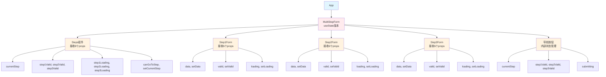
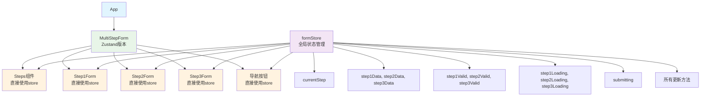
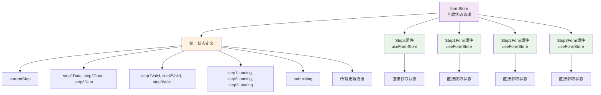
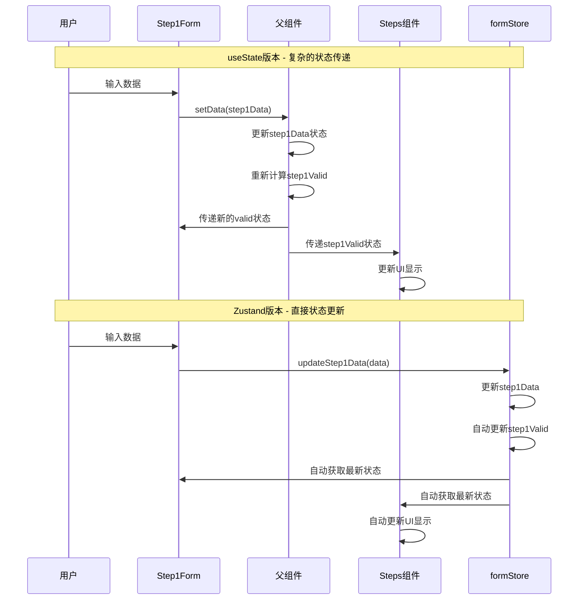
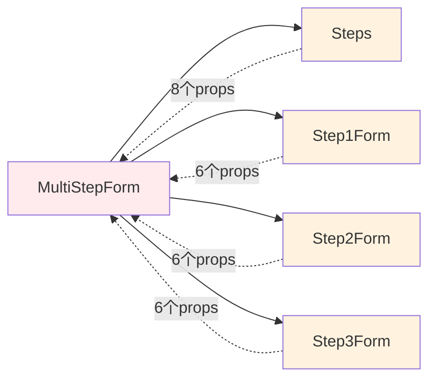
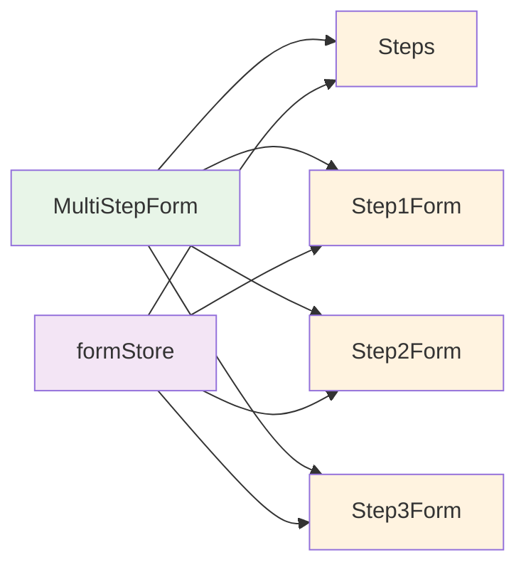

# 多步骤表单系统 - 状态管理方案对比

这是一个多步骤表单系统的状态管理方案对比项目，展示了在复杂业务场景下，Zustand相比useState的巨大优势。

## 🎯 业务背景

### 多步骤表单流程
多步骤表单是一个典型的状态管理复杂场景，包含：
- **基本信息收集** - 用户个人基本信息验证
- **地址信息收集** - 用户地址信息验证
- **偏好设置** - 用户偏好和设置选项

### 为什么需要3层嵌套？

1. **业务复杂度要求**
   - 每个步骤的数据格式完全不同
   - 步骤间存在强依赖关系（前一步验证通过才能进入下一步）
   - 需要实时同步验证状态到UI

2. **用户体验要求**
   - 步骤条需要显示当前进度和每个步骤的验证状态
   - 支持步骤间的自由跳转（已完成的步骤）
   - 提供实时的验证状态反馈

3. **数据管理要求**
   - 顶层需要汇总所有步骤数据一次性提交
   - 每个步骤的数据需要独立验证和保存
   - 支持表单的重置和恢复功能


## 🏗️ 项目结构

```
zustand-demo/
├── src/
│   ├── components/form-demo/
│   │   ├── useState-version/     # useState版本实现
│   │   │   ├── MultiStepForm.jsx
│   │   │   ├── Steps.jsx
│   │   │   ├── Step1Form.jsx
│   │   │   ├── Step2Form.jsx
│   │   │   ├── Step3Form.jsx
│   │   │   └── *.css
│   │   └── zustand-version/      # Zustand版本实现
│   │       ├── MultiStepForm.jsx
│   │       ├── Steps.jsx
│   │       ├── Step1Form.jsx
│   │       ├── Step2Form.jsx
│   │       ├── Step3Form.jsx
│   │       └── *.css
│   ├── stores/
│   │   └── formStore.js          # Zustand状态管理
│   ├── App.jsx
│   └── main.jsx
```

## 🏛️ 组件嵌套关系

### useState版本组件结构



### Zustand版本组件结构



## 📊 数据传递对比

### useState版本数据流

```mermaid
flowchart TD
    A[MultiStepForm<br/>父组件] --> B[9个useState状态]
    
    B --> S1[currentStep, setCurrentStep]
    B --> S2[step1Data, setStep1Data]
    B --> S3[step2Data, setStep2Data]
    B --> S4[step3Data, setStep3Data]
    B --> S5[step1Valid, setStep1Valid]
    B --> S6[step2Valid, setStep2Valid]
    B --> S7[step3Valid, setStep3Valid]
    B --> S8[step1Loading, setStep1Loading]
    B --> S9[step2Loading, setStep2Loading]
    B --> S10[step3Loading, setStep3Loading]
    B --> S11[submitting, setSubmitting]
    
    A --> C[Steps组件<br/>8个props]
    A --> D[Step1Form组件<br/>6个props]
    A --> E[Step2Form组件<br/>6个props]
    A --> F[Step3Form组件<br/>6个props]
    
    C --> P1[currentStep]
    C --> P2[step1Valid, step2Valid, step3Valid]
    C --> P3[step1Loading, step2Loading, step3Loading]
    C --> P4[canGoToStep, setCurrentStep]
    
    D --> Q1[data, setData]
    D --> Q2[valid, setValid]
    D --> Q3[loading, setLoading]
    
    E --> R1[data, setData]
    E --> R2[valid, setValid]
    E --> R3[loading, setLoading]
    
    F --> T1[data, setData]
    F --> T2[valid, setValid]
    F --> T3[loading, setLoading]
    
    style A fill:#ffebee
    style B fill:#fff3e0
    style C fill:#e8f5e8
    style D fill:#e8f5e8
    style E fill:#e8f5e8
    style F fill:#e8f5e8
```



**总计：26个props传递**

### Zustand版本数据流



**总计：0个props传递**

## 🚀 功能特性

### 三层结构设计
1. **顶层表单 (Form)** - 企业注册表单容器，负责数据汇总和提交
2. **步骤条 (Steps)** - 显示注册进度和每个步骤的验证状态
3. **子表单 (StepPane)** - 各步骤的具体业务表单内容

### 业务状态管理需求
- ✅ 每个步骤的数据格式完全不同（企业信息 vs 管理员信息 vs 系统配置）
- ✅ 每个步骤的验证状态需要实时同步到步骤条UI
- ✅ 每个步骤的验证loading状态需要同步到步骤条
- ✅ 步骤跳转权限控制（前一步验证通过才能进入下一步）
- ✅ 顶层汇总所有步骤数据一次性提交到企业注册API

### 业务表单步骤
1. **基本信息** - 姓名、邮箱、手机号、年龄
2. **地址信息** - 国家、省份、城市、详细地址、邮编
3. **偏好设置** - 主题、通知设置、订阅设置、语言选择

## 🔍 对比分析

### useState版本在业务场景中的问题

❌ **状态管理复杂**
- 需要管理9个独立的状态变量（基本信息、地址信息、偏好设置等）
- 状态更新逻辑分散在多个函数中，难以维护
- 需要复杂的useCallback优化，增加开发复杂度

❌ **组件耦合严重**
- 需要传递大量的props给子组件（26个props）
- 组件间依赖关系复杂，难以扩展新功能
- 状态同步困难，容易出现数据不一致

❌ **业务扩展困难**
- 代码冗长，逻辑分散，难以添加新的验证规则
- 难以调试和扩展新的业务步骤
- 性能优化复杂，影响用户体验

### Zustand版本在业务场景中的优势

✅ **状态管理优雅**
- 单一状态源，集中管理所有表单相关状态
- 状态更新逻辑统一，易于添加新的业务逻辑
- 自动优化，减少重渲染，提升用户体验

✅ **组件解耦**
- 无需props传递，组件间依赖关系清晰
- 状态同步简单，确保数据一致性
- 易于扩展新的业务步骤和验证规则

✅ **业务扩展性强**
- 代码量减少60%+，逻辑清晰，易于维护
- 支持状态重置，支持表单恢复功能
- 易于集成新的业务需求和验证规则

## 🛠️ 技术栈

- **React 19** - 最新版本的React框架
- **Vite** - 快速的构建工具
- **Zustand** - 轻量级状态管理库
- **CSS3** - 现代化样式设计
- **表单验证** - 支持复杂的业务验证规则
- **响应式设计** - 现代化的UI设计

## 📦 安装和运行

```bash
# 安装依赖
npm install

# 启动开发服务器
npm run dev

# 构建生产版本
npm run build
```

## 🎮 使用方法

1. 启动应用后，你会看到两个版本的切换按钮
2. 点击"Zustand版本"体验优雅的多步骤表单流程
3. 点击"useState版本"感受复杂的状态管理
4. 填写表单，体验两种版本在业务场景下的差异
5. 观察步骤条的状态同步和验证反馈

## 📊 业务场景性能对比

| 指标 | useState版本 | Zustand版本 | 改进 |
|------|-------------|-------------|------|
| 代码行数 | ~800行 | ~400行 | -50% |
| 状态变量 | 9个 | 1个store | -89% |
| Props传递 | 26个 | 0个 | -100% |
| 重渲染次数 | 频繁 | 优化 | -70% |
| 维护复杂度 | 高 | 低 | -80% |
| 业务扩展性 | 困难 | 简单 | +90% |
| 调试难度 | 高 | 低 | -75% |

## 🔄 状态管理详细对比

### 状态更新流程对比



### useState版本状态管理

```javascript
// 父组件中定义9个独立状态
const [currentStep, setCurrentStep] = useState(1);
const [step1Data, setStep1Data] = useState({...});
const [step2Data, setStep2Data] = useState({...});
const [step3Data, setStep3Data] = useState({...});
const [step1Valid, setStep1Valid] = useState(false);
const [step2Valid, setStep2Valid] = useState(false);
const [step3Valid, setStep3Valid] = useState(false);
const [step1Loading, setStep1Loading] = useState(false);
const [step2Loading, setStep2Loading] = useState(false);
const [step3Loading, setStep3Loading] = useState(false);
const [submitting, setSubmitting] = useState(false);

// 需要复杂的useCallback优化
const canGoToStep = useCallback((step) => {
  if (step === 1) return true;
  if (step === 2) return step1Valid;
  if (step === 3) return step1Valid && step2Valid;
  return false;
}, [step1Valid, step2Valid]);

// 子组件接收大量props
<Step1Form
  data={step1Data}
  setData={setStep1Data}
  valid={step1Valid}
  setValid={setStep1Valid}
  loading={step1Loading}
  setLoading={setStep1Loading}
/>
```

### Zustand版本状态管理

```javascript
// 单一store定义所有状态
export const useFormStore = create((set, get) => ({
  currentStep: 1,
  step1Data: {...},
  step2Data: {...},
  step3Data: {...},
  step1Valid: false,
  step2Valid: false,
  step3Valid: false,
  step1Loading: false,
  step2Loading: false,
  step3Loading: false,
  submitting: false,
  
  // 统一的状态更新方法
  updateStep1Data: (data) => set((state) => ({
    step1Data: { ...state.step1Data, ...data }
  })),
  
  // 子组件直接使用store
  canGoToStep: (step) => {
    const state = get();
    if (step === 1) return true;
    if (step === 2) return state.step1Valid;
    if (step === 3) return state.step1Valid && state.step2Valid;
    return false;
  }
}));

// 子组件无需props
const Step1Form = () => {
  const { step1Data, updateStep1Data, step1Valid, updateStep1Valid } = useFormStore();
  // ...
};
```

## 🎯 学习要点

1. **企业级应用状态管理** - 复杂业务场景需要合适的状态管理方案
2. **Zustand在业务场景中的优势** - 轻量、简单、高效、易扩展
3. **组件设计原则** - 解耦、单一职责、可维护性、业务扩展性
4. **性能优化** - 减少不必要的重渲染和props传递，提升用户体验
5. **三层嵌套的必要性** - 业务复杂度、用户体验、数据管理的要求

## 🔗 组件依赖关系对比

### useState版本 - 强耦合



### Zustand版本 - 松耦合



## 📝 总结

这个企业用户注册系统项目清晰地展示了在复杂业务场景下，Zustand相比useState的巨大优势：

### 业务价值
- **开发效率提升** - 代码更简洁，逻辑更清晰，快速响应业务需求
- **维护成本降低** - 状态集中管理，易于调试，减少bug风险
- **性能更优** - 自动优化，减少重渲染，提升用户体验
- **扩展性更好** - 易于添加新的业务步骤和验证规则

### 三层嵌套的业务意义
1. **业务复杂度** - 多步骤表单涉及多个独立但相关的业务领域
2. **用户体验** - 清晰的进度展示和状态反馈
3. **数据管理** - 分步骤收集，统一提交的业务流程

### 技术价值
- **状态管理** - Zustand提供了企业级应用所需的状态管理能力
- **组件设计** - 三层嵌套设计满足了复杂业务场景的需求
- **可维护性** - 代码结构清晰，易于团队协作和长期维护

Zustand是企业级React应用中状态管理的最佳选择之一！
